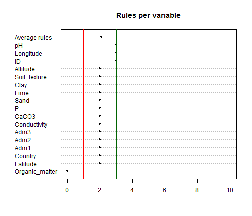
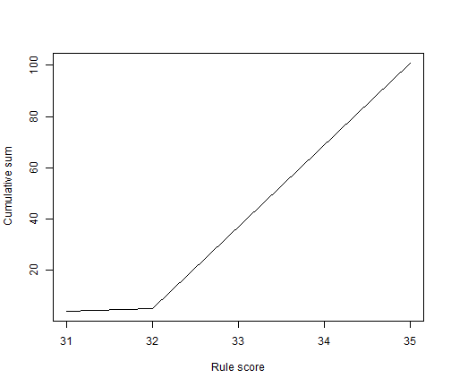
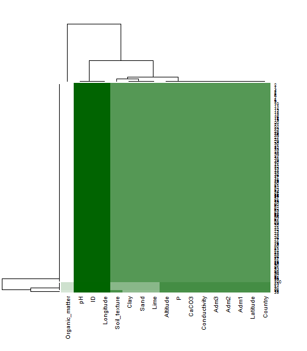

<!-- rmarkdown v1 -->


A vignette for *datacheck* (version 1.1.1)
========================================================
Reinhard Simon, International Potato Center, Lima, Peru

The library *datacheck* provides some simple functions to check the consistency of a dataset. It assumes data are available in tabular format - typically a csv file with
objects or records in rows and attributes or variables in the columns.

In a database setting the variables would be controlled by the database - at least
conformance to types (character, numeric, etc) and allowed min/maximum values.
However, often data are gathered in simple spreadsheets or are for other reasons 
without such constraints. Here, data constraints like allowed types or values, expected
values and relationships can be defined using R commands and syntax. This allows much
more flexibility and fine grained control. Typically it demands also a lot of domain
knowledge from the user. It is therefore often useful to re-use such domain aware rule files across tables with similar content. Therefore this tool is foregiving if rules cannot be executed if a variable is not present in the table to be analyzed allowing the reuse of such rule files.

Using the HTML interface
-----------------------


Use the following commands to copy some example files to your current working directory (uncomment the file.copy command):

```r
atable = system.file("examples/soilsamples.csv", package="datacheck")
srules = system.file("examples/soil_rules.R", package="datacheck")

# Uncomment the next two lines

# file.copy(atable, "soilsamples.csv")
# file.copy(srules, "soil_rules.R")
```
Then type in the command *run_datacheck()* in the R editor.

Use the upload buttons to load the respective files in your working directory.
Review the results.


Using the command line interface
--------------------------------
Assuming you have copied the above mentioned files in your working directory proceed to
read in the data.


```r
atable = read.csv(atable, header = TRUE, stringsAsFactors = FALSE)
srules = read_rules(srules)
profil = datadict_profile(atable, srules)
```

You can inspect a graphical summary of rules per variable:


```r
rule_coverage(profil)
```

 

The cumulative number of records with increasing scores.

```r
score_sum(profil)
```

 

Or see the tables (only the first 20 records and first 6 columns shown):


```r
xtable(atable[1:20, 1:6])
```

<!-- html table generated in R 3.1.3 by xtable 1.7-4 package -->
<!-- Thu Apr 16 12:26:21 2015 -->
<table border=1>
<tr> <th>  </th> <th> ID </th> <th> Latitude </th> <th> Longitude </th> <th> Country </th> <th> Adm1 </th> <th> Adm2 </th>  </tr>
  <tr> <td align="right"> 1 </td> <td align="right"> 767 </td> <td align="right"> -12.03 </td> <td align="right"> -75.24 </td> <td> Peru </td> <td> Junin </td> <td> Huancayo </td> </tr>
  <tr> <td align="right"> 2 </td> <td align="right"> 1029 </td> <td align="right"> -12.08 </td> <td align="right"> -76.95 </td> <td> Peru </td> <td> Lima </td> <td> Lima </td> </tr>
  <tr> <td align="right"> 3 </td> <td align="right"> 236 </td> <td align="right"> -12.03 </td> <td align="right"> -75.24 </td> <td> Peru </td> <td> Junin </td> <td> Huancayo </td> </tr>
  <tr> <td align="right"> 4 </td> <td align="right"> 759 </td> <td align="right"> -9.28 </td> <td align="right"> -77.63 </td> <td> Peru </td> <td> Ancash </td> <td> Carhuaz </td> </tr>
  <tr> <td align="right"> 5 </td> <td align="right">  71 </td> <td align="right"> -5.89 </td> <td align="right"> -76.11 </td> <td> Peru </td> <td> Loreto </td> <td> Alto Amazonas </td> </tr>
  <tr> <td align="right"> 6 </td> <td align="right"> 839 </td> <td align="right"> -11.41 </td> <td align="right"> -76.34 </td> <td> Peru </td> <td> Junin </td> <td> Yauli </td> </tr>
  <tr> <td align="right"> 7 </td> <td align="right"> 1082 </td> <td align="right"> -12.08 </td> <td align="right"> -76.95 </td> <td> Peru </td> <td> Lima </td> <td> Lima </td> </tr>
  <tr> <td align="right"> 8 </td> <td align="right"> 1603 </td> <td align="right"> -12.00 </td> <td align="right"> -75.22 </td> <td> Peru </td> <td> Junin </td> <td> Huancayo </td> </tr>
  <tr> <td align="right"> 9 </td> <td align="right"> 206 </td> <td align="right"> -11.12 </td> <td align="right"> -75.35 </td> <td> Peru </td> <td> Junin </td> <td> Chanchamayo </td> </tr>
  <tr> <td align="right"> 10 </td> <td align="right"> 389 </td> <td align="right"> -12.08 </td> <td align="right"> -76.95 </td> <td> Peru </td> <td> Lima </td> <td> Lima </td> </tr>
  <tr> <td align="right"> 11 </td> <td align="right"> 1317 </td> <td align="right"> -15.84 </td> <td align="right"> -70.03 </td> <td> Peru </td> <td> Puno </td> <td> Puno </td> </tr>
  <tr> <td align="right"> 12 </td> <td align="right"> 922 </td> <td align="right"> -12.03 </td> <td align="right"> -75.25 </td> <td> Peru </td> <td> Junin </td> <td> Huancayo </td> </tr>
  <tr> <td align="right"> 13 </td> <td align="right"> 278 </td> <td align="right"> -5.93 </td> <td align="right"> -76.13 </td> <td> Peru </td> <td> Loreto </td> <td> Alto Amazonas </td> </tr>
  <tr> <td align="right"> 14 </td> <td align="right"> 722 </td> <td align="right"> -7.08 </td> <td align="right"> -78.34 </td> <td> Peru </td> <td> Cajamarca </td> <td> Cajamarca </td> </tr>
  <tr> <td align="right"> 15 </td> <td align="right"> 529 </td> <td align="right"> -18.18 </td> <td align="right"> -70.47 </td> <td> Peru </td> <td> Tacna </td> <td> Tacna </td> </tr>
  <tr> <td align="right"> 16 </td> <td align="right"> 108 </td> <td align="right"> -5.89 </td> <td align="right"> -76.11 </td> <td> Peru </td> <td> Loreto </td> <td> Alto Amazonas </td> </tr>
  <tr> <td align="right"> 17 </td> <td align="right"> 1591 </td> <td align="right"> -12.08 </td> <td align="right"> -76.95 </td> <td> Peru </td> <td> Lima </td> <td> Lima </td> </tr>
  <tr> <td align="right"> 18 </td> <td align="right">  98 </td> <td align="right"> -5.89 </td> <td align="right"> -76.11 </td> <td> Peru </td> <td> Loreto </td> <td> Alto Amazonas </td> </tr>
  <tr> <td align="right"> 19 </td> <td align="right"> 132 </td> <td align="right"> -5.89 </td> <td align="right"> -76.11 </td> <td> Peru </td> <td> Loreto </td> <td> Alto Amazonas </td> </tr>
  <tr> <td align="right"> 20 </td> <td align="right"> 1598 </td> <td align="right"> -12.08 </td> <td align="right"> -76.95 </td> <td> Peru </td> <td> Lima </td> <td> Lima </td> </tr>
   </table>

Similarly for the score table; however, this table contains also the total counts of scores by records and variables. In addition, the maximum score by variable.

```r
ps = profil$scores
recs = c(1:10, nrow(ps)-1, nrow(ps))
cols = c(1:4,  ncol(ps))
xtable(ps[recs, cols])
```

<!-- html table generated in R 3.1.3 by xtable 1.7-4 package -->
<!-- Thu Apr 16 12:26:21 2015 -->
<table border=1>
<tr> <th>  </th> <th> ID </th> <th> Latitude </th> <th> Longitude </th> <th> Country </th> <th> Record.score </th>  </tr>
  <tr> <td align="right"> 1 </td> <td align="right"> 3.00 </td> <td align="right"> 2.00 </td> <td align="right"> 3.00 </td> <td align="right"> 2.00 </td> <td align="right"> 35.00 </td> </tr>
  <tr> <td align="right"> 2 </td> <td align="right"> 3.00 </td> <td align="right"> 2.00 </td> <td align="right"> 3.00 </td> <td align="right"> 2.00 </td> <td align="right"> 35.00 </td> </tr>
  <tr> <td align="right"> 3 </td> <td align="right"> 3.00 </td> <td align="right"> 2.00 </td> <td align="right"> 3.00 </td> <td align="right"> 2.00 </td> <td align="right"> 35.00 </td> </tr>
  <tr> <td align="right"> 4 </td> <td align="right"> 3.00 </td> <td align="right"> 2.00 </td> <td align="right"> 3.00 </td> <td align="right"> 2.00 </td> <td align="right"> 35.00 </td> </tr>
  <tr> <td align="right"> 5 </td> <td align="right"> 3.00 </td> <td align="right"> 2.00 </td> <td align="right"> 3.00 </td> <td align="right"> 2.00 </td> <td align="right"> 35.00 </td> </tr>
  <tr> <td align="right"> 6 </td> <td align="right"> 3.00 </td> <td align="right"> 2.00 </td> <td align="right"> 3.00 </td> <td align="right"> 2.00 </td> <td align="right"> 35.00 </td> </tr>
  <tr> <td align="right"> 7 </td> <td align="right"> 3.00 </td> <td align="right"> 2.00 </td> <td align="right"> 3.00 </td> <td align="right"> 2.00 </td> <td align="right"> 35.00 </td> </tr>
  <tr> <td align="right"> 8 </td> <td align="right"> 3.00 </td> <td align="right"> 2.00 </td> <td align="right"> 3.00 </td> <td align="right"> 2.00 </td> <td align="right"> 35.00 </td> </tr>
  <tr> <td align="right"> 9 </td> <td align="right"> 3.00 </td> <td align="right"> 2.00 </td> <td align="right"> 3.00 </td> <td align="right"> 2.00 </td> <td align="right"> 35.00 </td> </tr>
  <tr> <td align="right"> 10 </td> <td align="right"> 3.00 </td> <td align="right"> 2.00 </td> <td align="right"> 3.00 </td> <td align="right"> 2.00 </td> <td align="right"> 35.00 </td> </tr>
  <tr> <td align="right"> Attribute.score </td> <td align="right"> 300.00 </td> <td align="right"> 200.00 </td> <td align="right"> 300.00 </td> <td align="right"> 200.00 </td> <td align="right"> 3481.00 </td> </tr>
  <tr> <td align="right"> Rules.per.variable </td> <td align="right"> 3.00 </td> <td align="right"> 2.00 </td> <td align="right"> 3.00 </td> <td align="right"> 2.00 </td> <td align="right"> 35.00 </td> </tr>
   </table>

A last visualization is a heatmap of the score table to organize similar records and similar rule profiles to help detect any patterns,

 

Checking tables with data _inconsistencies_
--------------------------

For comparative purposes we purposely introduce a few errors in our table as below. We also exclude a rule on soil types for better display.

```r
atable$P[1]  = -100
atable$pH[11]= -200
srule1 = srules[-c(33),]
profil = datadict_profile(atable, srule1)
```

To get a better handle on the data it is always informative to review simple descriptive
summaries of the data. A custom summary function is included in the package to display this summary in tabular form:


```r
xtable(short_summary(atable))
```

<!-- html table generated in R 3.1.3 by xtable 1.7-4 package -->
<!-- Thu Apr 16 12:26:22 2015 -->
<table border=1>
<tr> <th>  </th> <th> n </th> <th> missing </th> <th> unique </th> <th> value </th> <th> min </th> <th> max </th> <th> Mean </th> <th> sd </th> <th> .05 </th> <th> .10 </th> <th> .25 </th> <th> .50 </th> <th> .75 </th> <th> .90 </th> <th> .95 </th>  </tr>
  <tr> <td align="right"> ID </td> <td> 100 </td> <td> 0 </td> <td> 100 </td> <td>  </td> <td> 5 </td> <td> 1685 </td> <td> 822.6 </td> <td> 498.51 </td> <td>   96.65 </td> <td>  114.70 </td> <td>  424.50 </td> <td>  838.00 </td> <td> 1190.00 </td> <td> 1549.60 </td> <td> 1605.70 </td> </tr>
  <tr> <td align="right"> Latitude </td> <td> 100 </td> <td> 0 </td> <td> 40 </td> <td>  </td> <td> -18.1817 </td> <td> -5.8939 </td> <td> -12.23 </td> <td> 3.07 </td> <td> -18.182 </td> <td> -18.182 </td> <td> -12.078 </td> <td> -12.028 </td> <td> -11.371 </td> <td>  -8.702 </td> <td>  -5.894 </td> </tr>
  <tr> <td align="right"> Longitude </td> <td> 100 </td> <td> 0 </td> <td> 42 </td> <td>  </td> <td> -78.34 </td> <td> -70.0292 </td> <td> -74.87 </td> <td> 2.39 </td> <td> -76.95 </td> <td> -76.95 </td> <td> -76.92 </td> <td> -75.35 </td> <td> -75.08 </td> <td> -70.47 </td> <td> -70.03 </td> </tr>
  <tr> <td align="right"> Country </td> <td> 100 </td> <td> 0 </td> <td> 1 </td> <td> Peru </td> <td>  </td> <td>  </td> <td>  </td> <td>  </td> <td>  </td> <td>  </td> <td>  </td> <td>  </td> <td>  </td> <td>  </td> <td>  </td> </tr>
  <tr> <td align="right"> Adm1 </td> <td> 100 </td> <td> 0 </td> <td> 11 </td> <td>  </td> <td>  </td> <td>  </td> <td>  </td> <td>  </td> <td>  </td> <td>  </td> <td>  </td> <td>  </td> <td>  </td> <td>  </td> <td>  </td> </tr>
  <tr> <td align="right"> Adm2 </td> <td> 98 </td> <td> 2 </td> <td> 18 </td> <td>  </td> <td>  </td> <td>  </td> <td>  </td> <td>  </td> <td>  </td> <td>  </td> <td>  </td> <td>  </td> <td>  </td> <td>  </td> <td>  </td> </tr>
  <tr> <td align="right"> Adm3 </td> <td> 99 </td> <td> 1 </td> <td> 26 </td> <td>  </td> <td>  </td> <td>  </td> <td>  </td> <td>  </td> <td>  </td> <td>  </td> <td>  </td> <td>  </td> <td>  </td> <td>  </td> <td>  </td> </tr>
  <tr> <td align="right"> pH </td> <td> 100 </td> <td> 0 </td> <td> 56 </td> <td>  </td> <td> -200 </td> <td> 8.59 </td> <td> 4.402 </td> <td> 20.69 </td> <td> 3.910 </td> <td> 4.390 </td> <td> 5.175 </td> <td> 7.200 </td> <td> 7.500 </td> <td> 7.710 </td> <td> 8.000 </td> </tr>
  <tr> <td align="right"> Conductivity </td> <td> 100 </td> <td> 0 </td> <td> 74 </td> <td>  </td> <td> 0.05 </td> <td> 21.3 </td> <td> 1.66 </td> <td> 2.58 </td> <td> 0.1395 </td> <td> 0.1690 </td> <td> 0.2400 </td> <td> 0.6250 </td> <td> 2.3550 </td> <td> 4.3460 </td> <td> 5.2650 </td> </tr>
  <tr> <td align="right"> CaCO3 </td> <td> 100 </td> <td> 0 </td> <td> 23 </td> <td>  </td> <td> 0 </td> <td> 47.6 </td> <td> 1.573 </td> <td> 5.67 </td> <td>  0.000 </td> <td>  0.000 </td> <td>  0.000 </td> <td>  0.000 </td> <td>  0.220 </td> <td>  5.156 </td> <td> 10.940 </td> </tr>
  <tr> <td align="right"> Organic_matter </td> <td> 100 </td> <td> 0 </td> <td> 70 </td> <td>  </td> <td> 0.1 </td> <td> 36.7 </td> <td> 2.681 </td> <td> 4.44 </td> <td> 0.5475 </td> <td> 0.6900 </td> <td> 1.0150 </td> <td> 1.5000 </td> <td> 2.5250 </td> <td> 4.6300 </td> <td> 8.0150 </td> </tr>
  <tr> <td align="right"> P </td> <td> 100 </td> <td> 0 </td> <td> 86 </td> <td>  </td> <td> -100 </td> <td> 74 </td> <td> 17.07 </td> <td> 18.56 </td> <td>  3.895 </td> <td>  4.550 </td> <td>  6.800 </td> <td> 14.900 </td> <td> 22.400 </td> <td> 39.240 </td> <td> 47.245 </td> </tr>
  <tr> <td align="right"> Sand </td> <td> 95 </td> <td> 5 </td> <td> 34 </td> <td>  </td> <td> 14 </td> <td> 98 </td> <td> 52.93 </td> <td> 16.62 </td> <td> 22.0 </td> <td> 32.0 </td> <td> 43.0 </td> <td> 51.0 </td> <td> 65.0 </td> <td> 72.0 </td> <td> 77.2 </td> </tr>
  <tr> <td align="right"> Lime </td> <td> 95 </td> <td> 5 </td> <td> 26 </td> <td>  </td> <td> 2 </td> <td> 50 </td> <td> 30.14 </td> <td> 8.95 </td> <td> 18.0 </td> <td> 20.0 </td> <td> 24.0 </td> <td> 30.0 </td> <td> 36.0 </td> <td> 41.2 </td> <td> 44.0 </td> </tr>
  <tr> <td align="right"> Clay </td> <td> 95 </td> <td> 5 </td> <td> 22 </td> <td>  </td> <td> 0 </td> <td> 42 </td> <td> 16.77 </td> <td> 9.37 </td> <td>  4.0 </td> <td>  6.0 </td> <td> 10.0 </td> <td> 16.0 </td> <td> 22.0 </td> <td> 28.0 </td> <td> 34.3 </td> </tr>
  <tr> <td align="right"> Soil_texture </td> <td> 96 </td> <td> 4 </td> <td> 9 </td> <td>  </td> <td>  </td> <td>  </td> <td>  </td> <td>  </td> <td>  </td> <td>  </td> <td>  </td> <td>  </td> <td>  </td> <td>  </td> <td>  </td> </tr>
  <tr> <td align="right"> Altitude </td> <td> 100 </td> <td> 0 </td> <td> 41 </td> <td>  </td> <td> 78 </td> <td> 4417 </td> <td> 1722 </td> <td> 1603.76 </td> <td>   78.0 </td> <td>   78.0 </td> <td>  235.0 </td> <td>  827.5 </td> <td> 3299.0 </td> <td> 3846.0 </td> <td> 3848.0 </td> </tr>
   </table>

A summary of the results by rule can be seen from the profil object:


```r
xtable(profil$checks)
```

<!-- html table generated in R 3.1.3 by xtable 1.7-4 package -->
<!-- Thu Apr 16 12:26:22 2015 -->
<table border=1>
<tr> <th>  </th> <th> Variable </th> <th> Type </th> <th> Rule </th> <th> Comment </th> <th> Execution </th> <th> Error.sum </th> <th> Error.list </th>  </tr>
  <tr> <td align="right"> 1 </td> <td> ID </td> <td> integer </td> <td> is.integer(ID) </td> <td> None </td> <td> ok </td> <td align="right">   0 </td> <td> none </td> </tr>
  <tr> <td align="right"> 2 </td> <td> ID </td> <td> integer </td> <td> !duplicated(ID) </td> <td> None </td> <td> ok </td> <td align="right">   0 </td> <td> none </td> </tr>
  <tr> <td align="right"> 3 </td> <td> ID </td> <td> integer </td> <td> ID &gt; 0 &amp; ID &lt; 1754 </td> <td> None </td> <td> ok </td> <td align="right">   0 </td> <td> none </td> </tr>
  <tr> <td align="right"> 4 </td> <td> Latitude </td> <td> numeric </td> <td> is.numeric(Latitude) </td> <td> None </td> <td> ok </td> <td align="right">   0 </td> <td> none </td> </tr>
  <tr> <td align="right"> 5 </td> <td> Latitude </td> <td> numeric </td> <td> Latitude &lt; 0 </td> <td> None </td> <td> ok </td> <td align="right">   0 </td> <td> none </td> </tr>
  <tr> <td align="right"> 6 </td> <td> Longitude </td> <td> numeric </td> <td> is.numeric(Longitude) </td> <td> None </td> <td> ok </td> <td align="right">   0 </td> <td> none </td> </tr>
  <tr> <td align="right"> 7 </td> <td> Longitude </td> <td> numeric </td> <td> Longitude &lt; 180 &amp; Longitude &gt; -180 </td> <td> None </td> <td> ok </td> <td align="right">   0 </td> <td> none </td> </tr>
  <tr> <td align="right"> 8 </td> <td> Longitude </td> <td> numeric </td> <td> is.null(Longitude) == is.null(Latitude) </td> <td> None </td> <td> ok </td> <td align="right">   0 </td> <td> none </td> </tr>
  <tr> <td align="right"> 9 </td> <td> Adm1 </td> <td> character </td> <td> is.character(Adm1) </td> <td> None </td> <td> ok </td> <td align="right">   0 </td> <td> none </td> </tr>
  <tr> <td align="right"> 10 </td> <td> Adm2 </td> <td> character </td> <td> is.character(Adm2) </td> <td> None </td> <td> ok </td> <td align="right">   0 </td> <td> none </td> </tr>
  <tr> <td align="right"> 11 </td> <td> Adm3 </td> <td> character </td> <td> is.character(Adm3) </td> <td> None </td> <td> ok </td> <td align="right">   0 </td> <td> none </td> </tr>
  <tr> <td align="right"> 12 </td> <td> Country </td> <td> character </td> <td> is.character(Country) </td> <td> None </td> <td> ok </td> <td align="right">   0 </td> <td> none </td> </tr>
  <tr> <td align="right"> 13 </td> <td> Altitude </td> <td> integer </td> <td> is.integer(Altitude) </td> <td> None </td> <td> ok </td> <td align="right">   0 </td> <td> none </td> </tr>
  <tr> <td align="right"> 14 </td> <td> Adm1 </td> <td> character </td> <td> is.null(Adm1) == is.null(Longitude) </td> <td>  </td> <td> ok </td> <td align="right">   0 </td> <td> none </td> </tr>
  <tr> <td align="right"> 15 </td> <td> Adm2 </td> <td> character </td> <td> is.null(Adm2) == is.null(Longitude) </td> <td> None </td> <td> ok </td> <td align="right">   0 </td> <td> none </td> </tr>
  <tr> <td align="right"> 16 </td> <td> Adm3 </td> <td> character </td> <td> is.null(Adm3) == is.null(Longitude) </td> <td> None </td> <td> ok </td> <td align="right">   0 </td> <td> none </td> </tr>
  <tr> <td align="right"> 17 </td> <td> Country </td> <td> character </td> <td> is.null(Country) == is.null(Longitude) </td> <td> None </td> <td> ok </td> <td align="right">   0 </td> <td> none </td> </tr>
  <tr> <td align="right"> 18 </td> <td> Altitude </td> <td> integer </td> <td> is.null(Altitude) == is.null(Longitude) </td> <td> None </td> <td> ok </td> <td align="right">   0 </td> <td> none </td> </tr>
  <tr> <td align="right"> 19 </td> <td> pH </td> <td> numeric </td> <td> is.numeric(pH) </td> <td> None </td> <td> ok </td> <td align="right">   0 </td> <td> none </td> </tr>
  <tr> <td align="right"> 20 </td> <td> pH </td> <td> numeric </td> <td> pH &gt;= 0 </td> <td> pH bigger than </td> <td> ok </td> <td align="right">   1 </td> <td> 11 </td> </tr>
  <tr> <td align="right"> 21 </td> <td> pH </td> <td> numeric </td> <td> pH &lt;= 14 </td> <td> pH lesser than </td> <td> ok </td> <td align="right">   0 </td> <td> none </td> </tr>
  <tr> <td align="right"> 22 </td> <td> Conductivity </td> <td> numeric </td> <td> is.numeric(Conductivity) </td> <td> None </td> <td> ok </td> <td align="right">   0 </td> <td> none </td> </tr>
  <tr> <td align="right"> 23 </td> <td> Conductivity </td> <td> numeric </td> <td> Conductivity &gt;= 0 </td> <td> None </td> <td> ok </td> <td align="right">   0 </td> <td> none </td> </tr>
  <tr> <td align="right"> 24 </td> <td> CaCO3 </td> <td> numeric </td> <td> is.numeric(CaCO3) </td> <td> None </td> <td> ok </td> <td align="right">   0 </td> <td> none </td> </tr>
  <tr> <td align="right"> 25 </td> <td> CaCO3 </td> <td> numeric </td> <td> CaCO3 &gt;= 0 </td> <td> None </td> <td> ok </td> <td align="right">   0 </td> <td> none </td> </tr>
  <tr> <td align="right"> 26 </td> <td> Sand </td> <td> numeric </td> <td> is.numeric(Sand) </td> <td> None </td> <td> ok </td> <td align="right">   0 </td> <td> none </td> </tr>
  <tr> <td align="right"> 27 </td> <td> Sand </td> <td> numeric </td> <td> is_within_range(Sand, 0, 100) </td> <td> None </td> <td> ok </td> <td align="right">   0 </td> <td> none </td> </tr>
  <tr> <td align="right"> 28 </td> <td> Lime </td> <td> numeric </td> <td> is.numeric(Lime) </td> <td> None </td> <td> ok </td> <td align="right">   0 </td> <td> none </td> </tr>
  <tr> <td align="right"> 29 </td> <td> Lime </td> <td> numeric </td> <td> is_within_range(Lime, 0, 100) </td> <td> None </td> <td> ok </td> <td align="right">   0 </td> <td> none </td> </tr>
  <tr> <td align="right"> 30 </td> <td> Clay </td> <td> numeric </td> <td> is.numeric(Clay) </td> <td> None </td> <td> ok </td> <td align="right">   0 </td> <td> none </td> </tr>
  <tr> <td align="right"> 31 </td> <td> Clay </td> <td> numeric </td> <td> is_within_range(Clay, 0, 100) </td> <td> None </td> <td> ok </td> <td align="right">   0 </td> <td> none </td> </tr>
  <tr> <td align="right"> 32 </td> <td> Soil_texture </td> <td> character </td> <td> is.character(Soil_texture) </td> <td> None </td> <td> ok </td> <td align="right">   0 </td> <td> none </td> </tr>
  <tr> <td align="right"> 34 </td> <td> P </td> <td> numeric </td> <td> is.numeric(P) </td> <td> None </td> <td> ok </td> <td align="right">   0 </td> <td> none </td> </tr>
  <tr> <td align="right"> 35 </td> <td> P </td> <td> numeric </td> <td> P &gt;= 0 </td> <td> None </td> <td> ok </td> <td align="right">   1 </td> <td> 1 </td> </tr>
   </table>

The *checks* part lists all erroneous records in the last column for each rule. This may be too long for printing. To this end a custom print report function only displays the first n records where n=5 is the default. 


```r
atable$Sand[20:30] = -1
profil = datadict_profile(atable, srule1)
```


```r
xtable(prep4rep(profil$checks))
```

<!-- html table generated in R 3.1.3 by xtable 1.7-4 package -->
<!-- Thu Apr 16 12:26:22 2015 -->
<table border=1>
<tr> <th>  </th> <th> Variable </th> <th> Type </th> <th> Rule </th> <th> Comment </th> <th> Execution </th> <th> Error.sum </th> <th> Error.list </th>  </tr>
  <tr> <td align="right"> 1 </td> <td> ID </td> <td> integer </td> <td> is.integer(ID) </td> <td> None </td> <td> ok </td> <td align="right">   0 </td> <td> none </td> </tr>
  <tr> <td align="right"> 2 </td> <td> ID </td> <td> integer </td> <td> !duplicated(ID) </td> <td> None </td> <td> ok </td> <td align="right">   0 </td> <td> none </td> </tr>
  <tr> <td align="right"> 3 </td> <td> ID </td> <td> integer </td> <td> ID &gt; 0 &amp; ID &lt; 1754 </td> <td> None </td> <td> ok </td> <td align="right">   0 </td> <td> none </td> </tr>
  <tr> <td align="right"> 4 </td> <td> Latitude </td> <td> numeric </td> <td> is.numeric(Latitude) </td> <td> None </td> <td> ok </td> <td align="right">   0 </td> <td> none </td> </tr>
  <tr> <td align="right"> 5 </td> <td> Latitude </td> <td> numeric </td> <td> Latitude &lt; 0 </td> <td> None </td> <td> ok </td> <td align="right">   0 </td> <td> none </td> </tr>
  <tr> <td align="right"> 6 </td> <td> Longitude </td> <td> numeric </td> <td> is.numeric(Longitude) </td> <td> None </td> <td> ok </td> <td align="right">   0 </td> <td> none </td> </tr>
  <tr> <td align="right"> 7 </td> <td> Longitude </td> <td> numeric </td> <td> Longitude &lt; 180 &amp; Longitude &gt; -180 </td> <td> None </td> <td> ok </td> <td align="right">   0 </td> <td> none </td> </tr>
  <tr> <td align="right"> 8 </td> <td> Longitude </td> <td> numeric </td> <td> is.null(Longitude) == is.null(Latitude) </td> <td> None </td> <td> ok </td> <td align="right">   0 </td> <td> none </td> </tr>
  <tr> <td align="right"> 9 </td> <td> Adm1 </td> <td> character </td> <td> is.character(Adm1) </td> <td> None </td> <td> ok </td> <td align="right">   0 </td> <td> none </td> </tr>
  <tr> <td align="right"> 10 </td> <td> Adm2 </td> <td> character </td> <td> is.character(Adm2) </td> <td> None </td> <td> ok </td> <td align="right">   0 </td> <td> none </td> </tr>
  <tr> <td align="right"> 11 </td> <td> Adm3 </td> <td> character </td> <td> is.character(Adm3) </td> <td> None </td> <td> ok </td> <td align="right">   0 </td> <td> none </td> </tr>
  <tr> <td align="right"> 12 </td> <td> Country </td> <td> character </td> <td> is.character(Country) </td> <td> None </td> <td> ok </td> <td align="right">   0 </td> <td> none </td> </tr>
  <tr> <td align="right"> 13 </td> <td> Altitude </td> <td> integer </td> <td> is.integer(Altitude) </td> <td> None </td> <td> ok </td> <td align="right">   0 </td> <td> none </td> </tr>
  <tr> <td align="right"> 14 </td> <td> Adm1 </td> <td> character </td> <td> is.null(Adm1) == is.null(Longitude) </td> <td>  </td> <td> ok </td> <td align="right">   0 </td> <td> none </td> </tr>
  <tr> <td align="right"> 15 </td> <td> Adm2 </td> <td> character </td> <td> is.null(Adm2) == is.null(Longitude) </td> <td> None </td> <td> ok </td> <td align="right">   0 </td> <td> none </td> </tr>
  <tr> <td align="right"> 16 </td> <td> Adm3 </td> <td> character </td> <td> is.null(Adm3) == is.null(Longitude) </td> <td> None </td> <td> ok </td> <td align="right">   0 </td> <td> none </td> </tr>
  <tr> <td align="right"> 17 </td> <td> Country </td> <td> character </td> <td> is.null(Country) == is.null(Longitude) </td> <td> None </td> <td> ok </td> <td align="right">   0 </td> <td> none </td> </tr>
  <tr> <td align="right"> 18 </td> <td> Altitude </td> <td> integer </td> <td> is.null(Altitude) == is.null(Longitude) </td> <td> None </td> <td> ok </td> <td align="right">   0 </td> <td> none </td> </tr>
  <tr> <td align="right"> 19 </td> <td> pH </td> <td> numeric </td> <td> is.numeric(pH) </td> <td> None </td> <td> ok </td> <td align="right">   0 </td> <td> none </td> </tr>
  <tr> <td align="right"> 20 </td> <td> pH </td> <td> numeric </td> <td> pH &gt;= 0 </td> <td> pH bigger than </td> <td> ok </td> <td align="right">   1 </td> <td> 11 </td> </tr>
  <tr> <td align="right"> 21 </td> <td> pH </td> <td> numeric </td> <td> pH &lt;= 14 </td> <td> pH lesser than </td> <td> ok </td> <td align="right">   0 </td> <td> none </td> </tr>
  <tr> <td align="right"> 22 </td> <td> Conductivity </td> <td> numeric </td> <td> is.numeric(Conductivity) </td> <td> None </td> <td> ok </td> <td align="right">   0 </td> <td> none </td> </tr>
  <tr> <td align="right"> 23 </td> <td> Conductivity </td> <td> numeric </td> <td> Conductivity &gt;= 0 </td> <td> None </td> <td> ok </td> <td align="right">   0 </td> <td> none </td> </tr>
  <tr> <td align="right"> 24 </td> <td> CaCO3 </td> <td> numeric </td> <td> is.numeric(CaCO3) </td> <td> None </td> <td> ok </td> <td align="right">   0 </td> <td> none </td> </tr>
  <tr> <td align="right"> 25 </td> <td> CaCO3 </td> <td> numeric </td> <td> CaCO3 &gt;= 0 </td> <td> None </td> <td> ok </td> <td align="right">   0 </td> <td> none </td> </tr>
  <tr> <td align="right"> 26 </td> <td> Sand </td> <td> numeric </td> <td> is.numeric(Sand) </td> <td> None </td> <td> ok </td> <td align="right">   0 </td> <td> none </td> </tr>
  <tr> <td align="right"> 27 </td> <td> Sand </td> <td> numeric </td> <td> is_within_range(Sand, 0, 100) </td> <td> None </td> <td> ok </td> <td align="right">  11 </td> <td> 20,21,22,23,24 ... more </td> </tr>
  <tr> <td align="right"> 28 </td> <td> Lime </td> <td> numeric </td> <td> is.numeric(Lime) </td> <td> None </td> <td> ok </td> <td align="right">   0 </td> <td> none </td> </tr>
  <tr> <td align="right"> 29 </td> <td> Lime </td> <td> numeric </td> <td> is_within_range(Lime, 0, 100) </td> <td> None </td> <td> ok </td> <td align="right">   0 </td> <td> none </td> </tr>
  <tr> <td align="right"> 30 </td> <td> Clay </td> <td> numeric </td> <td> is.numeric(Clay) </td> <td> None </td> <td> ok </td> <td align="right">   0 </td> <td> none </td> </tr>
  <tr> <td align="right"> 31 </td> <td> Clay </td> <td> numeric </td> <td> is_within_range(Clay, 0, 100) </td> <td> None </td> <td> ok </td> <td align="right">   0 </td> <td> none </td> </tr>
  <tr> <td align="right"> 32 </td> <td> Soil_texture </td> <td> character </td> <td> is.character(Soil_texture) </td> <td> None </td> <td> ok </td> <td align="right">   0 </td> <td> none </td> </tr>
  <tr> <td align="right"> 34 </td> <td> P </td> <td> numeric </td> <td> is.numeric(P) </td> <td> None </td> <td> ok </td> <td align="right">   0 </td> <td> none </td> </tr>
  <tr> <td align="right"> 35 </td> <td> P </td> <td> numeric </td> <td> P &gt;= 0 </td> <td> None </td> <td> ok </td> <td align="right">   1 </td> <td> 1 </td> </tr>
   </table>


Using rules that can't be executed
----------------------------------
This may happen if the syntax is wrong. Another reason - particularly if re-using rule files across tables - maybe that a particular variable name is not present amongst the column names of the present table. The tool will just ignore it and report a 'failed' execution. Let us simply modify an existing rule as below:


```r
srule1$Variable[25] = "caCO3"
srule1$Rule[25] = "caCO3 >= 0"
profil = datadict_profile(atable, srule1)
```

Now let us just look at an excerpt of the results table:


```r
xtable(prep4rep(profil$checks[20:30,]))
```

<!-- html table generated in R 3.1.3 by xtable 1.7-4 package -->
<!-- Thu Apr 16 12:26:22 2015 -->
<table border=1>
<tr> <th>  </th> <th> Variable </th> <th> Type </th> <th> Rule </th> <th> Comment </th> <th> Execution </th> <th> Error.sum </th> <th> Error.list </th>  </tr>
  <tr> <td align="right"> 20 </td> <td> pH </td> <td> numeric </td> <td> pH &gt;= 0 </td> <td> pH bigger than </td> <td> ok </td> <td align="right">   1 </td> <td> 11 </td> </tr>
  <tr> <td align="right"> 21 </td> <td> pH </td> <td> numeric </td> <td> pH &lt;= 14 </td> <td> pH lesser than </td> <td> ok </td> <td align="right">   0 </td> <td> none </td> </tr>
  <tr> <td align="right"> 22 </td> <td> Conductivity </td> <td> numeric </td> <td> is.numeric(Conductivity) </td> <td> None </td> <td> ok </td> <td align="right">   0 </td> <td> none </td> </tr>
  <tr> <td align="right"> 23 </td> <td> Conductivity </td> <td> numeric </td> <td> Conductivity &gt;= 0 </td> <td> None </td> <td> ok </td> <td align="right">   0 </td> <td> none </td> </tr>
  <tr> <td align="right"> 24 </td> <td> CaCO3 </td> <td> numeric </td> <td> is.numeric(CaCO3) </td> <td> None </td> <td> ok </td> <td align="right">   0 </td> <td> none </td> </tr>
  <tr> <td align="right"> 25 </td> <td> caCO3 </td> <td> numeric </td> <td> caCO3 &gt;= 0 </td> <td> None </td> <td> failed </td> <td align="right">   0 </td> <td> NA </td> </tr>
  <tr> <td align="right"> 26 </td> <td> Sand </td> <td> numeric </td> <td> is.numeric(Sand) </td> <td> None </td> <td> ok </td> <td align="right">   0 </td> <td> none </td> </tr>
  <tr> <td align="right"> 27 </td> <td> Sand </td> <td> numeric </td> <td> is_within_range(Sand, 0, 100) </td> <td> None </td> <td> ok </td> <td align="right">  11 </td> <td> 20,21,22,23,24 ... more </td> </tr>
  <tr> <td align="right"> 28 </td> <td> Lime </td> <td> numeric </td> <td> is.numeric(Lime) </td> <td> None </td> <td> ok </td> <td align="right">   0 </td> <td> none </td> </tr>
  <tr> <td align="right"> 29 </td> <td> Lime </td> <td> numeric </td> <td> is_within_range(Lime, 0, 100) </td> <td> None </td> <td> ok </td> <td align="right">   0 </td> <td> none </td> </tr>
  <tr> <td align="right"> 30 </td> <td> Clay </td> <td> numeric </td> <td> is.numeric(Clay) </td> <td> None </td> <td> ok </td> <td align="right">   0 </td> <td> none </td> </tr>
   </table>

_End of tutorial_


